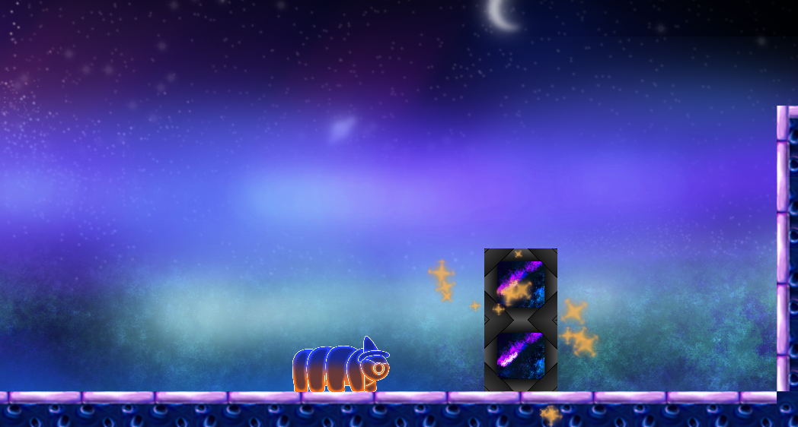
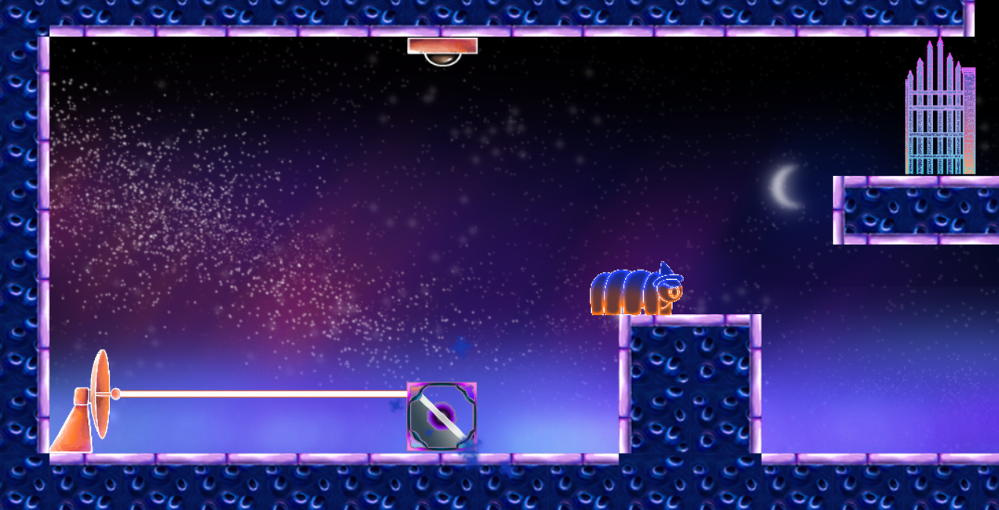
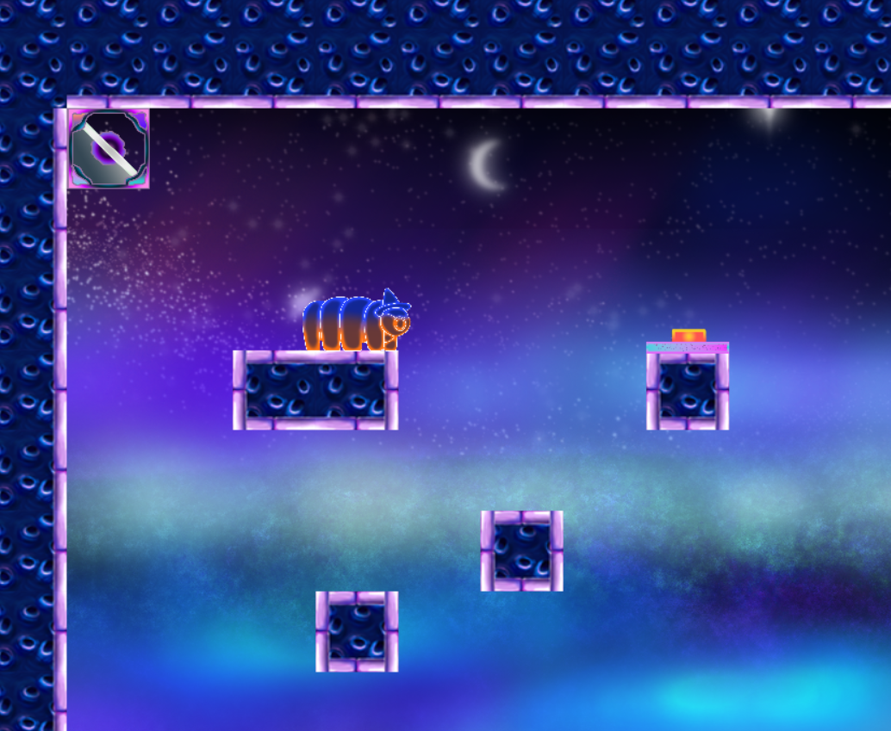
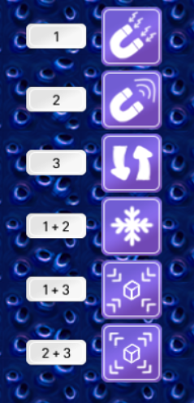
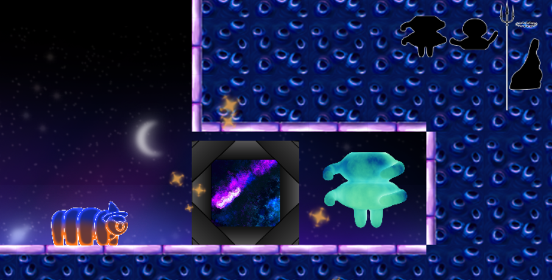
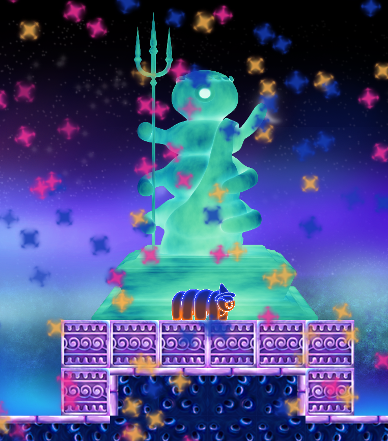

<h1 align="center">
  Tar the Great
   
</h1>

<h4 align="center">A physics-based puzzle game</h4>

  

## Inroduction

This game was made during a project in the first year of univerity. It is based on the GXP engine, provided by Saxion Univerity of Applied Sciences.
The game was made in collaboration with five of my peers, however the coding was done exclusively by myself.

## Installation

To play this game you just need to download this repository as a ZIP and extract it to some folder. Then excecute the GXPEngine.exe inside the folder "TarTheGreatGame".
It's as easy as that!

If you press escape anytime during the game, you will be transported to the menu screen. The only progressed saved are the doors you opened and the items you collected.
Be careful though! If you want to continue the game at a later time, you need to exit by pressing escape and then quit in the menu. Otherwise your progress will not be saved!

If you want to start a new game, simply delete the file "saveGame.txt" inside of the folder "TarTheGreatGame".

## Gameplay

Tar the Great is a game about a tardigrade mage in space, trying to repair a statue of his people. Yes you read that right.

  

It is a 2D puzzle game with some platforming thrown in there. The puzzles are phyisics-based and correctly implemented according to Newtons laws.
The player can walk, jump and has six magic abilites with which they can control objects in the levels.

  

  

These abilities can be activated by pressing the shown number combinations on the keyboard.

- 1 = attract objects
- 2 = repulse objetcs
- 3 = switch direction of gravity for objects
- 1 + 2 = freeze all objects in place
- 1 + 3 = shrink all objects
- 2 + 3 = enlarge all objects

  

Note that these abilites only work for objects in range, which is indicated by particle effects.

The goal of the game is to collect all three parts of the great statue and then combine them in the last level.

  

  

I hope you enjoy this game and manage to repair the great statue <3

-Alex
